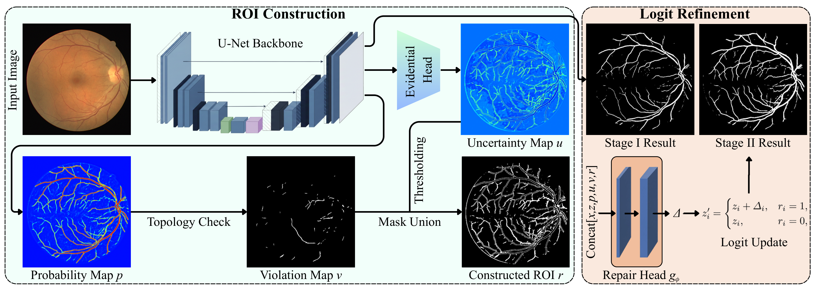
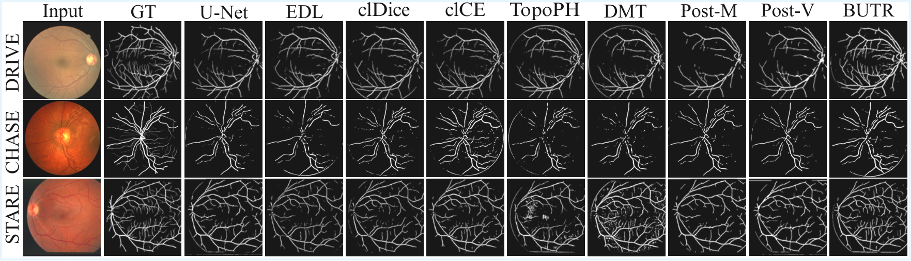

# BUTR: Budgeted Uncertainty-guided Topology Repair (MICCAI)

This repository contains the official PyTorch implementation of **BUTR** (**B**udgeted **U**ncertainty-guided **T**opology **R**epair), a **post-hoc refinement** framework for **retinal vessel segmentation**.
BUTR refines a backbone prediction **only inside a compact region-of-interest (ROI)** selected by (i) pixel-wise uncertainty and (ii) a fast topology/structure violation detector, under an explicit edit budget.

<p align="center">
  
</p>

<p align="center">
  
</p>

> **Figures.** The repository ships with example figures in `assets/`.
> To use your final paper figures, simply overwrite:
> - `assets/method.png` (method/framework figure)
> - `assets/qualitative.png` (qualitative visualization figure)

> **How to export from Overleaf:** open the figure PDF (or the compiled paper), download the figure as PDF, then convert to PNG (e.g., macOS Preview / Windows Photos / ImageMagick). Keep the filenames exactly as above.

---

## 1. Environment

```bash
conda create -n butr python=3.10 -y
conda activate butr
pip install -r requirements.txt
```

Tested with PyTorch >= 2.1.

---

## 2. Data preparation

We use three public fundus benchmarks for **retinal vessel segmentation**:

- **DRIVE**
- **CHASE\_DB1**
- **STARE**

Organize the datasets under a single `data_root` directory (any absolute or relative path is fine).
The dataset builders expect the standard file layout used in this project; if your raw downloads differ, adapt the paths in:
`topo_repair_pkg/data/{drive,chase,stare}.py`.

---

## 3. Running experiments (paper)

### Experiment 1: Multi-method comparison (U-Net)
Run evaluation for a dataset/method grid and export a summary CSV:

```bash
python -m experiments.exp1 --data_root <DATA_ROOT> --out_root results/exp1 --datasets drive,chase,stare
```

### Experiment 2: ROI guidance ablation
```bash
python -m experiments.exp2 --data_root <DATA_ROOT> --out_root results/exp2 --datasets drive,chase,stare
```

### Experiment 3: (Optional) aggregate / report script
This project includes lightweight aggregation utilities under `experiments/`.

---

## 4. Sensitivity / Specificity analysis (MICCAI tables)

If you have saved trained checkpoints under `models/<dataset>/<method>/model.pt` (and `repair.pt` for BUTR),
you can compute **Sensitivity**/**Specificity** over all splits and export a MICCAI CSV:

```bash
python analyze_miccai_sens_spec.py --data_root <DATA_ROOT> --models_root models --results_root results --datasets drive,chase,stare
```

This writes a CSV under `results/` (see the script arguments for the exact output path).

---

## 5. Topology/violation detector switch (for ablations)

The topology/structure certifier is **enabled by default**.
To disable it (e.g., for ablation runs), set:

```bash
# Linux/macOS
export TOPO_CERTIFY=0

# Windows PowerShell
$env:TOPO_CERTIFY="0"
```

---

## 6. Citation

If you use this code, please cite our paper:

```bibtex
@inproceedings{butr2026,
  title     = {BUTR: Budgeted Uncertainty-guided Topology Repair for Retinal Vessel Segmentation},
  author    = {Anonymous},
  booktitle = {MICCAI},
  year      = {2026}
}
```

> Replace the BibTeX with the final camera-ready entry.

---

## 7. License

This repository is released under the MIT License. See [LICENSE](LICENSE).
